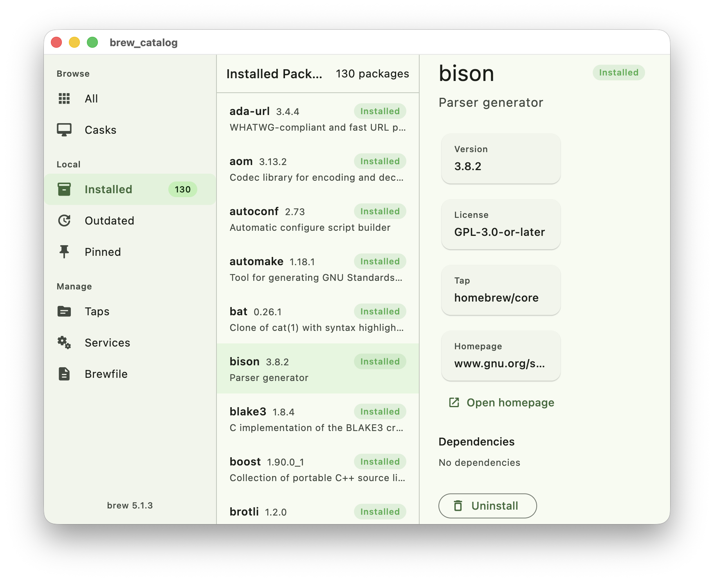

[](https://pub.dev/packages/brew_dart)
[](https://github.com/jwinarske/brew_dart/actions/workflows/ci.yml)
[](https://opensource.org/licenses/Apache-2.0)

# brew_dart

Full programmatic access to [Homebrew](https://brew.sh) from Dart on macOS and Linux.

Wraps the `brew` CLI using `Process.run` / `Process.start`, relying on `--json=v2` structured output wherever brew supports it, and falling back to sanitised text parsing only where JSON is unavailable.

## Platform Support

| Platform | Status |
|----------|--------|
| macOS    | Fully supported |
| Linux    | Supported (Linuxbrew) |
| Windows  | Not supported |

## Features

- **CLI-first** -- uses `brew info --json=v2` as the stable interface, not the HTTP API
- **Strongly-typed models** -- all JSON and text output parsed into immutable Dart classes via `freezed`
- **Stream-based output** -- long-running commands (install, upgrade, update) expose `Stream<ProcessOutput>` for real-time progress
- **Batch operations** -- multi-package install/remove/upgrade with parallel or sequential execution and per-package callbacks
- **Unified facade** -- single `Brew` class entry point for all operations
- **Optional HTTP client** -- standalone `BrewApiClient` for formulae.brew.sh catalog browsing (separate import, no `http` dependency in core)

## Flutter Example App

The `example/brew_catalog/` directory contains a full macOS desktop Flutter app built on top of `brew_dart` that demonstrates real-world usage: browsing the formula/cask catalog, viewing package details, managing taps, and reading Brewfiles.



## Installation

```yaml
dependencies:
  brew_dart: ^0.2.0
```

Then run code generation for the `freezed` models:

```bash
dart pub get
dart run build_runner build --delete-conflicting-outputs
```

## Quick Start

```dart
import 'package:brew_dart/brew_dart.dart';

void main() async {
  final brew = Brew();

  if (!await brew.isInstalled()) {
    print('Homebrew is not installed.');
    return;
  }
  print('Homebrew ${await brew.version()}');

  // Search for packages
  final results = await brew.search('node');
  print('Formulae: ${results.formulae.join(', ')}');

  // Get detailed info (JSON-backed)
  final info = await brew.info('node');
  print('Latest: ${info.formula!.versions.stable}');
  print('Dependencies: ${info.formula!.dependencies.join(', ')}');

  // See what's installed
  final installed = await brew.installed();
  print('${installed.length} packages installed');
}
```

## Usage

### Package Management

```dart
// Install a single package
final result = await brew.install('ripgrep');
print('Success: ${result.success} (${result.elapsed.inSeconds}s)');

// Install a cask
await brew.install('docker', cask: true);

// Batch install with progress callback
final batch = await brew.installAll(
  ['ripgrep', 'fd', 'bat', 'eza'],
  parallel: true,
  concurrency: 2,
  onEach: (pkg, res) {
    print('${res.success ? "+" : "x"} $pkg (${res.elapsed.inSeconds}s)');
  },
);
print('Installed ${batch.succeeded}/${batch.total}');

// Stream install output in real-time
await for (final output in brew.installStream('ffmpeg')) {
  print(output.line);
}

// Uninstall
await brew.uninstall('ripgrep');

// Upgrade
await brew.upgrade('node');

// Cleanup old versions
final cleanup = await brew.cleanup(dryRun: true);
print(cleanup.output);
```

### Querying

```dart
// Outdated packages (JSON-backed)
final outdated = await brew.outdated();
for (final pkg in outdated) {
  print('${pkg.name}: ${pkg.currentVersion} -> ${pkg.latestVersion}');
}

// Dependencies
final deps = await brew.deps('git');
print('git depends on: ${deps.join(', ')}');

// Reverse dependencies
final uses = await brew.uses('icu4c');
print('icu4c is used by: ${uses.join(', ')}');

// List installed (fast, names only)
final names = await brew.listNames();

// List installed (rich, full details via JSON)
final packages = await brew.listInstalled();
```

### Taps

```dart
final taps = await brew.taps();
for (final t in taps) {
  print('${t.name} (${t.formulaCount ?? 0} formulae)');
}

await brew.tap('homebrew/cask-fonts');
await brew.untap('homebrew/cask-fonts');
```

### Services

```dart
final services = await brew.services();
for (final s in services) {
  print('${s.name}: ${s.status.name}');
}

await brew.startService('postgresql@16');
await brew.stopService('postgresql@16');
await brew.restartService('redis');
```

### System Maintenance

```dart
// Update Homebrew itself
final update = await brew.update();

// Link / unlink keg-only formulae
await brew.link('openssl@3', force: true);
await brew.unlink('openssl@3');

// Pin / unpin to prevent upgrades
await brew.pin('node');
await brew.unpin('node');
final pinned = await brew.pinned();

// Diagnostics
final report = await brew.doctor();
if (!report.healthy) {
  for (final d in report.diagnostics) {
    print('${d.severity.name}: ${d.title}');
  }
}

// Configuration
final config = await brew.config();
print('Prefix: ${config.prefix}');
print('Cellar: ${config.cellar}');
```

### Brewfile Support

```dart
// Export current state to a Brewfile
await brew.bundleDump(file: 'Brewfile', force: true);

// Parse a Brewfile
final brewfile = await brew.readBrewfile('Brewfile');
for (final entry in brewfile.entries) {
  print('${entry.type.name}: ${entry.name}');
}

// Install everything from a Brewfile
final bundleResult = await brew.bundle(file: 'Brewfile');
print('Success: ${bundleResult.success}');

// Check Brewfile against installed packages
final check = await brew.bundleCheck(file: 'Brewfile');
print('Satisfied: ${check.satisfied}');
if (!check.satisfied) {
  print('Missing: ${check.missingEntries.join(', ')}');
}
```

### Optional HTTP API Client

For catalog browsing when brew may not be installed. Import separately -- this does not add an `http` dependency to the core package:

```dart
import 'package:brew_dart/remote.dart';

final client = BrewApiClient(
  httpGet: (url) async {
    // Bring your own HTTP client
    final response = await http.get(url);
    return response.body;
  },
);

final formulae = await client.allFormulae();
final detail = await client.formula('git');
final analytics = await client.installAnalytics(days: 30);
```

> **Note:** The formulae.brew.sh API serves static files with no versioning. It is read-only, knows nothing about local state, and may lag behind what `brew` sees locally. Use for browsing/discovery only, not as a source of truth.

## Architecture

```
lib/
├── brew_dart.dart                # main barrel export
├── remote.dart                   # optional HTTP API barrel
└── src/
    ├── brew.dart                 # unified Brew facade
    ├── exceptions.dart           # exception hierarchy
    ├── cli/
    │   ├── brew_cli.dart         # Process.run / Process.start wrapper
    │   └── brew_process_result.dart
    ├── models/                   # freezed data classes
    │   ├── formula.dart          # Formula, FormulaVersions, InstalledVersion
    │   ├── cask.dart             # Cask
    │   ├── tap.dart              # Tap
    │   ├── service.dart          # BrewService, ServiceStatus
    │   ├── brew_config.dart      # BrewConfig
    │   ├── doctor_report.dart    # DoctorReport, Diagnostic
    │   ├── outdated_package.dart # OutdatedPackage
    │   ├── batch_result.dart     # InstallResult, BatchResult, etc.
    │   ├── brewfile.dart         # Brewfile, BrewfileEntry
    │   └── ...
    ├── parsers/                  # JSON v2 + text output parsers
    └── remote/                   # optional HTTP API client
```

### Design Principles

1. **`--json=v2` wherever available** -- Homebrew's recommended stable interface for third-party tools.
2. **Clean environment defaults** -- every brew invocation sets `HOMEBREW_NO_COLOR`, `HOMEBREW_NO_EMOJI`, `HOMEBREW_NO_AUTO_UPDATE`, `HOMEBREW_NO_ANALYTICS`, `HOMEBREW_NO_ENV_HINTS`.
3. **Text parsing only as a fallback** -- tested against golden files of real brew output.
4. **No HTTP dependency in core** -- the optional `BrewApiClient` accepts an `HttpGetFn` typedef so consumers provide their own client.

## Exception Handling

```dart
try {
  await brew.install('nonexistent');
} on PackageNotFoundException catch (e) {
  print('Not found: ${e.packageName}');
} on DependencyConflictException catch (e) {
  print('${e.packageName} is required by: ${e.dependents}');
} on BrewCommandException catch (e) {
  print('Command failed: ${e.command} (exit ${e.exitCode})');
} on BrewNotInstalledException {
  print('Homebrew is not installed');
} on CommandTimeoutException catch (e) {
  print('Timed out after ${e.timeout.inSeconds}s');
}
```

## Testing

Three tiers of tests:

| Tier | Runs on | Frequency | Brew required |
|------|---------|-----------|---------------|
| **Unit tests** | Linux CI | every push | No (mocked) |
| **Integration tests** | macOS CI | weekly + releases | Yes |
| **Manual scripts** | local machine | before releases | Yes |

```bash
# Run unit tests
dart test --exclude-tags integration

# Run integration tests (requires Homebrew)
dart test --tags integration

# Capture fresh golden files from real brew output
./scripts/capture_golden_files.sh
```

## Contributing

1. Fork the repository
2. Create a feature branch
3. Run `dart run build_runner build --delete-conflicting-outputs` after model changes
4. Ensure `dart analyze` and `dart test --exclude-tags integration` pass
5. Submit a pull request

## License

Apache 2.0 -- see [LICENSE](LICENSE) for details.
